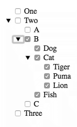

# checktree

A raw JavaScript V1 Web Component providing a tree of checkboxes and their labels.



You can load the CheckTree with all of the options at one time, or you can load a portion and then listen for the `load` event to know when a node is opened and needs it's data loaded. This allows for lazy loading of data based on the user requesting it.

## Install

Install the component using [Bower](http://bower.io/):

```sh
$ bower install checktreejs --save
```

## Usage

1. Import Web Components' polyfill on browsers that need it:

	```html
	<script src="bower_components/webcomponentsjs/webcomponents.min.js"></script>
	```

2. Import CheckTree Element:

    ```html
    <link rel="import" href="bower_components/checktreejs/checktree.html">
    ```

3. Start using it:

    ```html
    <check-tree id="myCheckTree"></check-tree>
    <script>
    var initialData = [
      { label: 'One', value: 1 },
      { label: 'Two', value: 2, children: [
        { label: 'A', value: 'SomeValue' },
        { label: 'B', value: 'AnotherValue', hasChildren: true },
        { label: 'PI', value: 3.1415 }
      ]},
      { label: 'Three', value: 3 }
    ];

    var children = [
      { label: 'Dog', value: 'Woof' },
      { label: 'Cat', value: 'Meow', hasChildren: true },
      { label: 'Pig', value: 'Grunt' }
    ];

    var cats = [
      { label: 'Tiger', value: 't' },
      { label: 'Puma',  value: 'p' },
      { label: 'Lion',  value: 'l' }
    ];

    function eh(e) {
      console.log(e);
    }

    function loadHandler(event) {
      var data = event.detail.node=== 'r.1.1' ? children : cats;

      // Use setTimeout to emulate async request for data
      setTimeout(() => {el.addOptions(data, event.detail.node)}, 500);
    }

    var el = document.getElementById('myCheckTree');
    el.addEventListener('changed', eh);
    el.addEventListener('load', loadHandler);
    el.addOptions(initialData);
    </script>
    ```

## API

See the [API.md](docs/API.md) file.

## License

[MIT License](http://opensource.org/licenses/MIT)

## History

See the [HISTORY.md](docs/HISTORY.md) file.