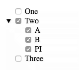

# checktree

A raw JavaScript V1 Web Component providing a tree of checkboxes and their labels.

## Install

Install the component using [Bower](http://bower.io/):

```sh
$ bower install checktreejs --save
```

## Usage

1. Import Web Components' polyfill on browsers that need it:

	```html
	<script src="bower_components/webcomponentsjs/webcomponents.min.js"></script>
	```

2. Import CheckTree Element:

    ```html
    <link rel="import" href="bower_components/checktreejs/checktree.html">
    ```

3. Start using it:

    ```html
    <check-tree id="myCheckTree"></check-tree>
    <script>
    var initialData = [
      { label: 'One', value: 1 },
      { label: 'Two', value: 2, children: [
        { label: 'A', value: 'SomeValue' },
        { label: 'B', value: 'AnotherValue', hasChildren: true },
        { label: 'PI', value: 3.1415 }
      ]},
      { label: 'Three', value: 3 }
    ];

    var children = [
      { label: 'Dog', value: 'Woof' },
      { label: 'Cat', value: 'Meow', hasChildren: true },
      { label: 'Pig', value: 'Grunt' }
    ];

    var cats = [
      { label: 'Tiger', value: 't' },
      { label: 'Puma',  value: 'p' },
      { label: 'Lion',  value: 'l' }
    ];

    function eh(e) {
      console.log(e);
    }

    function loadHandler(event) {
      var data = event.detail.node=== 'r.1.1' ? children : cats;

      // Use setTimeout to emulate async request for data
      setTimeout(() => {el.addOptions(data, event.detail.node)}, 500);
    }

    var el = document.getElementById('myCheckTree');
    el.addEventListener('changed', eh);
    el.addEventListener('load', loadHandler);
    el.addOptions(initialData);
    </script>
    ```

## API

### `checkedValues` read-only property

`checkedValues` is an array of objects that include both a node key and node value of all options that are currently checked in the CheckTree component.

For this configuration:



The value for `checkedValues` would be:

```json
[
  {
    "key": "r.1",
    "value": 2
  },
  {
    "key": "r.1.0",
    "value": "SomeValue"
  },
  {
    "key": "r.1.1",
    "value": "AnotherValue"
  },
  {
    "key": "r.1.2",
    "value": 3.1415
  }
]
```

The `key` value is a flat string that represents the node location. `r` represents the root of the data. `r.1` indicates the node at position 1 from the root. (Values are 0 based) checkbox 'One' is at position 0 and checkbox 'Two' is at position 1. So `r.1` refers to checkbox 'Two'. `r.1.0` refers to checkbox 'A' and `r.1.2` refers to checkbox 'PI'.

The length of the `key` value is based on the position of the checkbox that is checked. For example `r.1.2.4.2` would represent represent the checkbox at position `root[1][2][4][2]`
    
### `addOptions` Function

The `addOptions` function is used to add options into the CheckTree. The data passed in is an array of Option objects that contain, at a minimum a `label` and a `value`.

The Option objects has the following properties:

| Property | Description |
| --- | --- |
| `children` | An array of Options objects. This node will include an open button. When the user clicks on this open button the children will toggle between hidden and visible. |
| `hasChildren` | If this is `true` then this node will include an open button. When the user clicks on the open button the `load` event is dispatched to let your application know that is needs to load the children for this node. Once children are added to this node the `load` event is no longer dispatched. |
| `label` | The displayed value next to the checkbox. |
| `value` | The value passed back in the `changed` event. |

> The `initialData`, `children` and `cats` objects in the JavaScript code above are exampled of the option data passed into the `addOptions` function.

The second parameter passed into `addOptions` can be a node key or nothing. If it is nothing then you are adding options to the root node. If it is a valid node key then you are adding options to that specific node.

The code `el.addOptions(initialData);` in the example above adds the options to the root node.

The code `el.addOptions(data, event.detail.node)` in the example above adds the options to a specific node.

> There is no way to add options through DOM attributes. You must call `addOptions`.

### Events

CheckTree dispatched two unique events: `load` and `changed`.

#### `load` Event

The `load` event is dispatched to let your code know when it needs to load additional child data and add it back into CheckTree. The `load` event is only dispatched when the user clicks on an open button for a node that had the `hasChildren` property set to `true` but no children were provided. Once children are added to that node it will no longer dispatch the `load` event.

#### `changed` Event

The `changed` event is dispatched to let your code know that the user has changed the checked state of, at least, one checkbox. Each time the user checks or un-checks the a checkbox the `changed` event is dispatched.

The `changed` event is also be dispatched every time your code calls the `addOptions` function.


## License

[MIT License](http://opensource.org/licenses/MIT)
