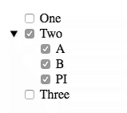

# checktree API

### `checkedValues` read-only property

`checkedValues` is an array of objects that include both a node key and node value of all options that are currently checked in the CheckTree component.

For this configuration:



The value for `checkedValues` would be:

```json
[
  {
    "key": "r.1",
    "value": 2
  },
  {
    "key": "r.1.0",
    "value": "SomeValue"
  },
  {
    "key": "r.1.1",
    "value": "AnotherValue"
  },
  {
    "key": "r.1.2",
    "value": 3.1415
  }
]
```

The `key` value is a flat string that represents the node location. `r` represents the root of the data. `r.1` indicates the node at position 1 from the root. (Values are 0 based) checkbox 'One' is at position 0 and checkbox 'Two' is at position 1. So `r.1` refers to checkbox 'Two'. `r.1.0` refers to checkbox 'A' and `r.1.2` refers to checkbox 'PI'.

The length of the `key` value is based on the position of the checkbox that is checked. For example `r.1.2.4.2` would represent represent the checkbox at position `root[1][2][4][2]`

### `addOptions` Function

The `addOptions` function is used to add options into the CheckTree.

There are three parameters passed into `addOptions(options[, parentId][, autoOpen])`.

The `options` parameter is an array of Option objects that contain, at a minimum a `label` and a `value`.

The `options` objects has the following properties:

| Property | Description |
| --- | --- |
| `children` | An array of Options objects. This node will include an open button. When the user clicks on this open button the children will toggle between hidden and visible. |
| `hasChildren` | If this is `true` then this node will include an open button. When the user clicks on the open button the `load` event is dispatched to let your application know that is needs to load the children for this node. Once children are added to this node the `load` event is no longer dispatched. |
| `label` | The displayed value next to the checkbox. |
| `value` | The value passed back in the `changed` event. |

> The `initialData`, `children` and `cats` objects in the JavaScript code above are exampled of the option data passed into the `addOptions` function.

The `parentId` can be excluded or passed in as `null` to specify that you are adding these `options` to the root node of the tree.

If `parentId` is a valid node key then you are adding the `options` to that specific node. If the node does not exist a `ReferenceError` is thrown.

`autoOpen` can be set to `true` and all of the new nodes that are added will be open be default. Any other value will leave the new nodes closed.

You can pass `true` as the second parameter if you are adding new `options` to the root of the tree and you want them to `autoOpen`.

Examples:

The code `el.addOptions(initialData);`, in the example above, adds the options to the root node.

The code `el.addOptions(data, event.detail.node);`, in the example above, adds the options to a specific node.

If you wanted to auto open the two example above they would be written like this:

```JavaScript
// Add the root options and auto open them
el.addOptions(initialData, true);

// Add the sub options and auto open them.
el.addOptions(data, event.detail.node, true);
```

> There is no way to add options through a DOM attribute. You must call the `addOptions` method.

### `changeLabel` Function

The `changeLabel` function allows you to change the text of a specific label. The function is called like this: `changeLabel(label, nodeId)`

The `label` parameter is the new text for the label. It must be a `string`.

The `nodeId` parameter is the id to specify which label you are changing. As defined in `checkedValues` above the `nodeId` is specified by using the indexed values of each branch in the tree to indicate which node to affect. A value of `r.0` will affect the first checkbox in the tree. A value of `r.1.0` will affect the first node that is a child of the second node of the tree.

### `isChecked` Function

The `isChecked` function returns the checked state of the node specified by the parameter `nodeId`.

Example:

```JavaScript
var chkd = el.isChecked('r.0');
```

### `removeOptions` Function

The `removeOptions` function allows you to clear the child options of any parent node. The function takes one, optional, parameter called `parentId` to specify the parent node. If `parentId` is undefined, then you are removing all children from the root node of the tree. This removes *all* children and empties the entire tree.

If `parentId` refers to a valid parent node that contains children then those children are removed.

Examples:

```JavaScript
// Remove all options from the tree
el.removeOptions();

// Remove only this options of the first node in the tree
el.removeOptions('r.0');
```

### `setChecked` Function

The `setChecked` function allows your code to set the checked state of the node specified by the parameter `nodeId`.

```JavaScript
// Check the first node
el.setChecked('r.0', true);

// Uncheck the second child node of the first node of the tree
el.setChecked('r.1.2', false);
```

### Events

CheckTree dispatched two unique events: `load` and `changed`.

#### `load` Event

The `load` event is dispatched to let your code know when it needs to load additional child data and add it back into CheckTree. The `load` event is only dispatched when the user clicks on an open button for a node that had the `hasChildren` property set to `true` but no children were provided. Once children are added to that node it will no longer dispatch the `load` event.

##### `Event.detail` property

The `load` event includes a `detail` property that signifies the node that is opening. The details value is:

```json
{
  "node": "r.1.2"
}
```

You use this value as the second param when you call `addOptions` to add the new options to that node instead of the root node.

```javascript
function loadHandler(event) {
  getData(event.detail.node).then(
    (data) => {
      el.addOptions(data, event.detail.node);
    }
  );
}
```

#### `changed` Event

The `changed` event is dispatched to let your code know that the user has changed the checked state of, at least, one checkbox. Each time the user checks or un-checks the a checkbox the `changed` event is dispatched.

The `changed` event is also be dispatched every time your code calls the `addOptions` function.

##### `Event.detail` property

The `changed` event includes a `detail` property that is the same value that can be obtained from the `checkedValues` property.

```javascript
function changedEventHandler(e) {
  console.log(JSON.stringify(e.detail,0,2));
}
```

> See **`checkedValues` Read-Only Property** above.
